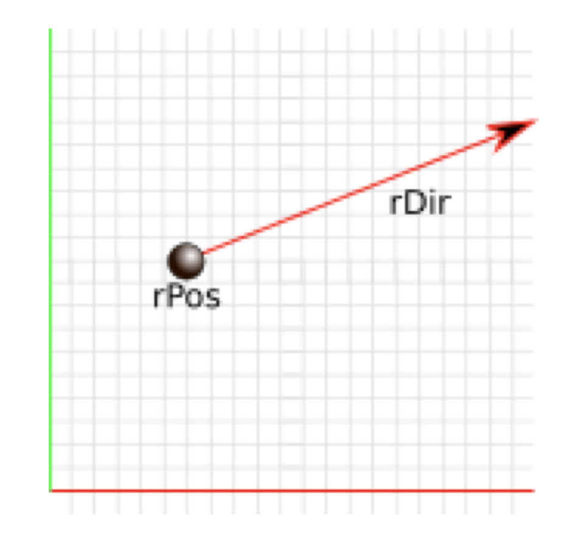
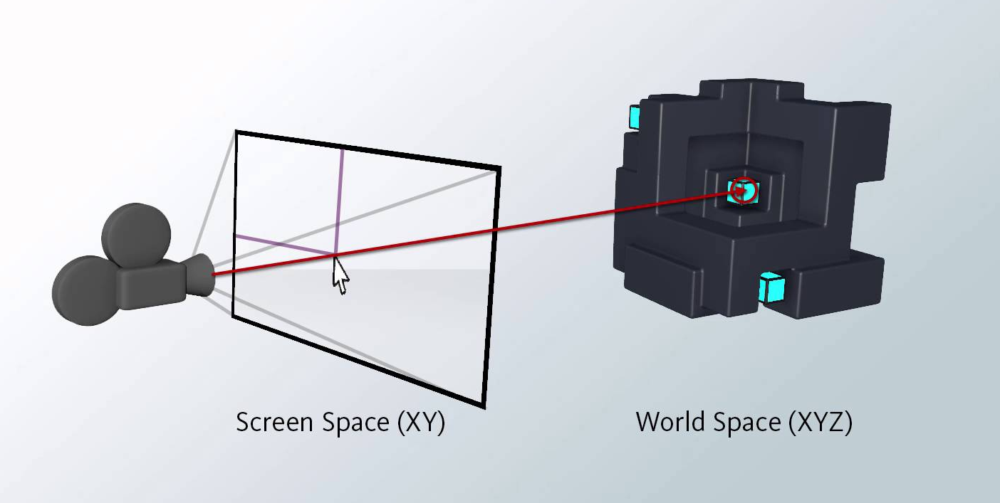
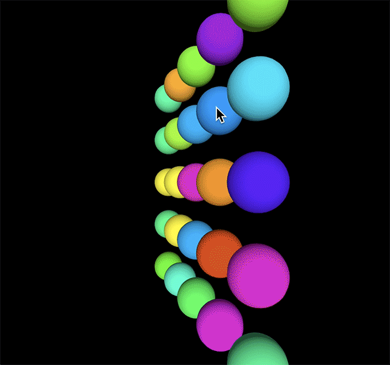
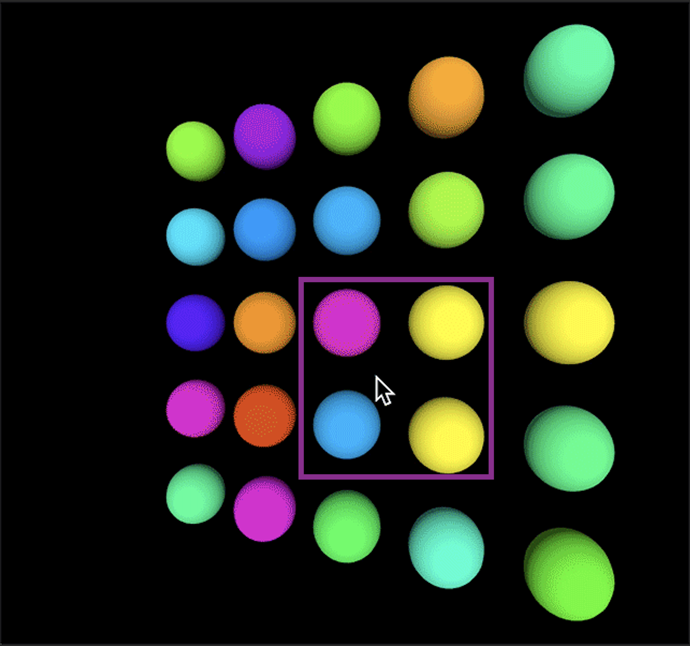
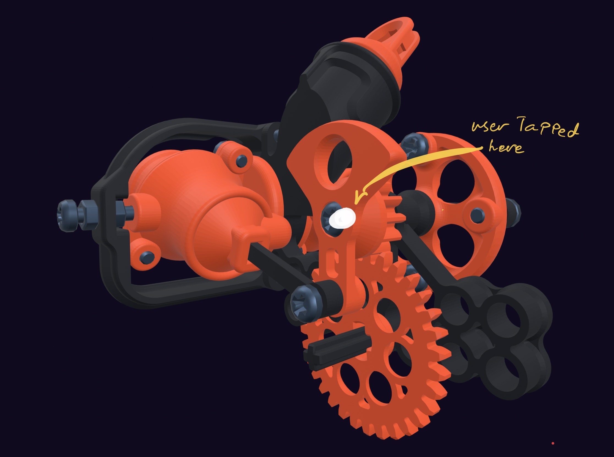
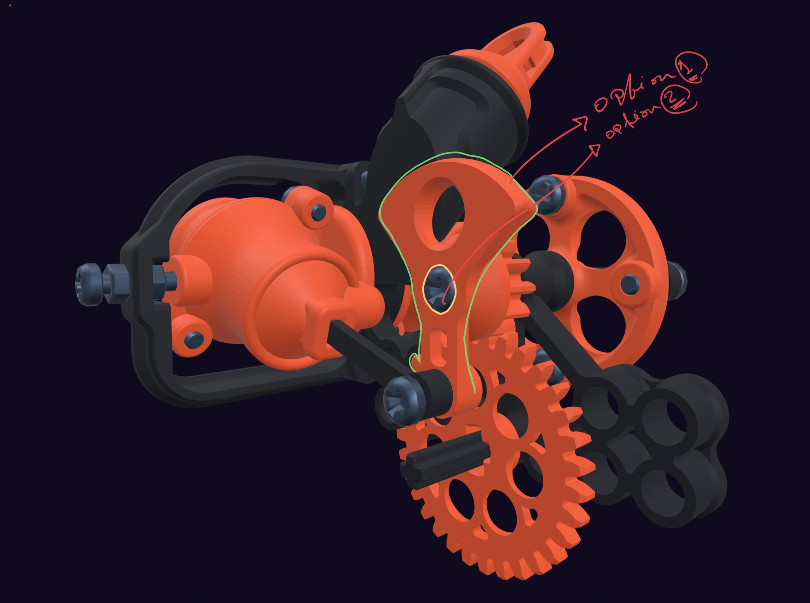
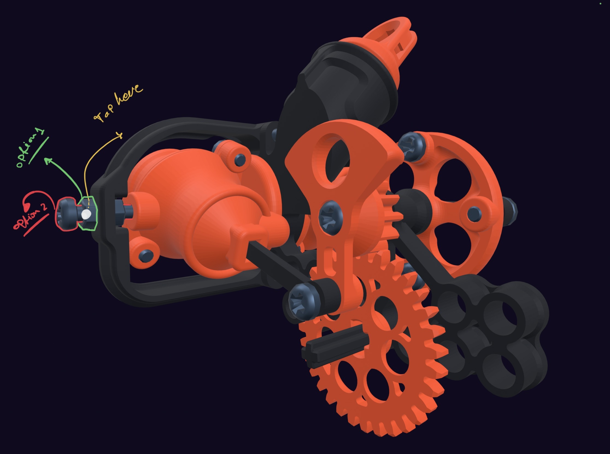

# ازاي تعمل Volume Casting

في المدونة دي هنتكلم عن ازاي نعمل امبلمنتيشن لفيتشر مش موجودة في SceneKit بس علشان نعمل الامبلمنتيشن محتاجين نفهم اكتر من عن الكونسبت نفسه، بعدين نشوف ايه المشكلة اللي عندنا، بعدين نشوف ازاي ممكن نحلها بالكودينج

## إيه هي الراي Ray

الراي في سياق الكمبيوتر جرافيكس و في سياق حديثنا النهاردة هي عبارة عن نقطة مع اتجاه، يعني تقدر تقول انه اسم آخر ل الڤيكتور

و تقدر تتخيل الراي على انها قلم ليزر  في ايدك، ليه بوزيشن، وقطعا ليه اتجاه، اللي هو اتجاه الانارة



في الصورة 

rPos = ray position in the space

rDir = ray dieraction in the space

## ايه هو الراي-كاستينج Ray Casting

الراي كاستينج هو عملية بنحاول نعرف فيها، اذا الراي اللي عندنا هتتقاطع مع اي جزء في السبيس ولا لا

لأنه الراي ليها نقطة واتجاه تقدر تمدها في السبيس براحتك، في الصورة دي الراي تم مدها في الفرغ، لغاية ما قطعت الكورة الكبيرة في النص، وبكدا نكون عرفنا انه الراي دي، بتقطع الكورة اللي في النص.. 


## مثال على الراي-كاستنج

فيه استخدامات كتير للموضوع دا، من اشهرها و اهمها، بيكون مع الماوس بتاع الكمبيوتر

تخيل انه عندك شاشة فيه اوبجكتس كتير كلها ثري-دي و عاوز لما تضغط بالماوس، الجزء المعين اللي ضغط عليه لونه يتغير، او يتحدد، زيه زي اي لعبة بالماوس بتلعبها ع الكمبيوتر، او حتى في الموبايل التاتش، كمثال الصورة دي



لما تكون انت شايف اللعبة (سكرين سبيس) فأنت شايف العالم من زاوية(عالم) الكاميرا، لما بتضغط بالماوس على مكان معين، اللي بيحصل انه بيطلع راي، و الراي دي بتكمل لغاية ما تخبط في اي عنصر، و ممكن في الواقع متخبطش خالص لو انت ضغط في حتة مفيهاش اوبجكت

لاحظ انه التحدي/المشكلة هنا انه لما بتضغط بالماوس فأنت بتضغط في السكرين سبيس ودا بيكون 2D لكن العالم اللي فيه الاوبجكتس بتاعتك بيكون ثري دي، و الهدف بتاع الراي كاستنج انه يعرف اذا مكان الماوس بتاعك في التو-دي بعد ما يتحول لثري-دي هيلمس جزء من الاوبجكتس بتاعتك ولا لا 

لما بنقول اوبجكتس فأحنا نقصد اي جزء ثري-دي في البرنامج/اللعبة زي الاشكال اللي فوق ع اليمين، او الكور اللي في اول ومثال، وهكذا 



هنا مثال اوضح للنتيجة النهائية، وهي بسيطة فعليا ، انك بتقدر تعرف الكورة اللي الماوس ضغط عليها، ودا مجرد مثال من امثلة استخدام الراي-كاستنج، و في الحالة دي بيطلق عليه

3D **Hit Testing/ Mouse Picking/ Picking

و ممكن يكون سؤالك هو: ازاي الراي كاستنج بيحصل رياضيًا، لأنه احنا وصفناه بالكلام لكن في الواقع رياضيا هو بيحصل على اكتر من خطوة، و نظرًا لأنه دي اصلا مقدمة للموضوع اللي عايز اتكلم فيه، مش هتطرق للتفاصيل الخاصة بالراي كاستنج.**

## الهيت تيستنج في محركات الالعاب

### Unity Ray casting

الهيت-تيستنج زي ما وضحنا فوق ببساطة بيستخدم لمعرفة اذا انت لمست جزء معين في اللعبة او البرنامج الثري-دي اللي انت شغال فيه ولا لا، ونظرا لأنه يعتبر شيء اساسي، يعتبر موجود ليه امبلمنتيشن في كل محركات الالعاب 

في يونيتي ممكن تعمل كدا

```
Ray ray = Camera.main.ScreenPointToRay(Input.mousePosition);
            RaycastHit hit;
            if (Physics.Raycast(ray, out hit, 100))
            {
                Debug.Log(hit.transform.name);
                Debug.Log("hit");
            }
```

فانكشن 
Phisycs.RayCast  هي اللي بتقوم بعمل كل حسابات الكاستنج  في يونيتي 

### SceneKit Ray Cast

 في سين كيت ممكن تعمل راي كاستنج(آبل بتسميه هيت تيستنج) عن طريق الكود الآتي و هيجيبلك اذا كانت الضغطة بتاعتك على اوبجكت معين

```
let locationOfTapIn2D = tapRecognizer.location(in: sceneView)
let hitResults = diagramView.sceneView.hitTest(locationOfTapIn2D, options: nil)
let tappedNode = hitResults.first?.node //the object you have tapped
```

كل اللي فات دا جميل، اتكلمنا عن الراي، و عن عملية الراي كاستنج، و ازاي متوفر في محركات الالعاب المختلفة

## حاجات الراي-كاستنج ميقدرش يعملها

تخيل انه عندك ابلكيشن بيتطلب انك تجيب اقرب  اوبجكتس لضغطة معينة

بمعنى انه في الصورة دي مطلوب منك تجيب اقرب اوبجكتس للضغطة، لأنه فعليا مكان الضغطة هنا في الفراغ اللي لونه اسود


و النتيجة المرادة كالآتي، انه احنا نقدر نحدد اقرب ٤ اوبجكتس للضغطة، او اقرب ٥، المهم نقدر نحدد 



الموضوع يصبح اكثر تعقيدا و اكثر اهمية لو بشكل عام انت عايز تجيب الاوبجكتس المتجاورة لأي ضغطة لو افترضت انه اليوزر ضغط بصباعه مكان ما ظاهر في الصورة



لأنه فيه اجزاء متداخلة، ممكن يكون اليوزر قاصده الجزء الصغير اللي لونه جراي، او الجزء البورتقالي الكبير



او هنا هنا مثلا، لو اليوزر لمس الجزء اللي متوضح في الصورة، فممكن يكون قصده الجزء الاخضر، او الاحمر



لو احنا استخدمنا الهيت-تيستنج مش هنقدر نعرف الاجزاء اللي جنب بعض، لأنه زي ما وضحنا فوق، هو بطلع راي واحدة بس، من مكان اللمسة، و و لما تخبط في جزء معين، يقولك انها خبطت فيه وبناء عليه يقولك انك حاولت تلمس الجزء المعين دا، في حالتنا عاوزين نحاول نعرف الاجزاء اللي الاقرب ل اللمسة، في الصورة دي بنوضح الراي بالاحمر، و انها في هتخبط في جزء واحد بس


اللي احنا محتاجينه، اننا نعمل حاجة مشابهة توصلنا لزيادة القطر بتاع الراي نفسها، فبدل ما تخبط في اوبجكت واحد، تخبط في الاتنين اللي جنب بعض 


لاحظ ازاي الراي متقاطعة مع الجزئين، بدل جزء واحد

الصورة اللي فوق بتوضح اللي نتمنى اننا نقدر نعمله، لكن فعليا منقدرش نعمل دا بالراي لأنها عبارة عن فيكتور مش حاجة ليها ثيكنس او نصف قطر، لكن دي اول نقطة تجاه الوصول للحل،اننا تخيلناه..

## انواع آخرى من الكاستنج

في بعض محركات الالعاب، فيه حل للموضوع دا، ببساطة بدل ما بتعمل كاستنج ب راي، ممكن تعمل كاستنج بمكعب، او كاستنج بسليندر

ازاي ؟ تعالى نتخيل انه مكان ما الراي هتخبط في جزء معين، هنحط مكعب 

وبعد ما نحط المكعب، نشوف بقى المكعب دا بيتقاطع مع اوبجكتس ولا لا، لو قدرنا نعمل كدا، نظريا المكعب هيتقاطع مع الاوبجكتس القريبة من الراي، حسب حجمه 


الطريقة دي من الكاستنج، اسمها ڤوليوم كاستنج، لأنك فيها بتعمل الكاستنج بالڤوليوم بتاع المكعب، او بتاع اي شكل اخر حسب اختيارك

في محرك زي يونيتي، موجود امبلمنتيشنز جاهزة بتعمل كاستنج للڤوليومز دي 
بأستخدام الطريقة دي، هيرجعلنا مثلا انه اليوزر بيحاول يضغط على

Option 1, or option 2

وبناء عليه ممكن نطلع دا في منيو بحيث هو يختار قصده انهي اوبجكت من الاتنين

1. **BoxCast 📦**
2. **Capsule Cast💊**
3. **Sphere Cast 🏀**
4. **RigidBody Cast 🥎**

## Volume Casting In SceneKit

علشان نعمل شيء مشابهة للڤوليوم كاستنج في سين كيت، محتاجين نحاول نعمل مجموعة من الخطوات

1- Detect Touch Location using Normal HitTesting (already discussed the code)

In this stage we will convert the touch location from 2D space (Device screen) to a 3D space (World space) which will let us know where our touches belong to in the 3D world.

2- place a cube, which has an origin equal to the detected point of hit testing

In this step, we will place an cube on the previously determined 3D Point from step 1

3- calculate/process the intersections with that cube

This will be fun …

## Technical Implementation of Volume Casting In SceneKit

### 1. Detect Touch Location

في الخطوة دي هنشتغل كأننا كنا عاوزين نعمل راي كاستنج عادي

```
//Inside the tap gesture Selector
let locationOfTapIn2D = tapRecognizer.location(in: sceneView)
let hitResults = diagramView.sceneView.hitTest(locationOfTapIn2D, options: nil)
let firstTappedNode = hitResults.first //the object you have tapped
```

### 2. Place the cube(Box)

```
let boxHeight = 12 

let boxGeometry = SCNBox.init(width: boxHeight,
 height: boxHeight,
 length: boxHeight, 
 chamferRadius: 2)

let boxNode = SCNNode(geometry: boxGeometry) 
//Note that the node is placed to the root node (World space) 
sceneView?.scene?.rootNode.addChildNode(boxNode)
//Place the box at the touch Coordinates
boxNode.worldPosition = firstHit.worldCoordinates
boxNode.name = "VOLUME_CASTING_BOX"
//This's important because you don't want the user to see the box you've placed.
boxNode.isHidden = true 
//PhisycsBody is needed so we can check later which objects 
// 'are intersecting with this box 
boxNode.physicsBody = .init(type: .kinematic,
 shape: .init(node: boxNode, options: [:]))
```

هنا حطينا البوكس اللي بنتكلم عنه، اللي هو هيبقى زي البوكس الاصفر اللي في الصورة اللي فوق، و حددنا له اسم، و حددنا المكان بتاعه ، بالظبط زي الصورة اللي فوق

### 3. Check which objects are intersecting with the placed box:

اللي احنا عاوزين نعمله هنا، اننا نشوف البادي بتاع البوكس، بيتقاطع مع مين، ممكن تحقق دا عن طريق استخدام
الفانكشن بترجع اراي من `SCNPhysicsContact`

ودا تايب بيحفظ جواه تفاصيل التقاطع الخاصة بالمكعب، و بما انها اراي، فدا معناه انه المكعب قد يتقاطع مع اكتر من اوبجكت، يعني لو معانا الاراي دي، نقدر نعرف اللمسة بتاعتنا قريبة من اي اوبجكت في الورلد


التايب الخاص ب `SCNPhysicsContact`

مهم جدا و بيحتوي على كل التفاصيل الخاصة بالكونتاكت، الكونتاكت الواحد في حالتنا معناه انه دا اوبجكت يتقاطع مع المكعب اللي احنا حطيناه 

لو عندنا ٢ كونتاكت، يبقى فيه ٢ اوجكت يتقاطع مع المكعب

دا الهيدر بتاع `SCNPhysicsContact`


لاحظ هنا انه كل كونتاكت بيعطيلك ٢ نود

NodeA, NodeB

الاولاني هيكون المكعب بتاعك، التاني، اللي هو نود بي، هيكون الجزء اللي بيتقاطع معاه وبناء عليه ممكن تكتب الآتي

```
let boxContacts = scene.physicsWorld.contactTest(with: boxNode.physicsBody!, options: [:]

if boxContacts.count > 0 {
//Print Contacts name
 let nodesNames = boxContacts
    .map { $0.nodeB.name ?? "NO_OBJECT_NAME" }
    .filter { $0 != "VOLUME_CASTING_BOX" }

    print(nodesNames)

// Also, you have access to the node itself
// in case you want to highlight it/scale it/do whatever you want
boxContacts.forEach { contactWithBox in
    print(contactWithBox.nodeB)
    }
 }
```

### ختام الامبلمنتيشن

الكود الاخير لو محطوط في Main Thread

غالبا الكود هيكراش، ليه ؟ علشان سين كيت شغالة من ثريد خاص بيها و بناء عليه فيه احتمالية مش قليلة ل الريس كونديشنز، و عموما افضل حاجة انها تأكسس سين كيت ديما و ابدا من الثريد بتاعها.. ازاي ؟ 

محتاج تكونفيرم ل SCNSceneRendererDelegate

و يكون الكود بتاعك في الفانكشن دي، 

الفانكشن دي بيتعملها كول لكل فريم هيتعمله رندر، نظريا اللعبة او البرنامج بتاعك ممكن يكون كله في الفانكشن دي، ودا الصح لو انت عايز البرنامج بتاعك يكون ثريد سيف، بس في اغلب الاحيان هتجد صعوبة كبيرة في انك تهندل اللوجيك كله فيها

لأنه علشان دي فانكشن بيتعملها كول لكل فريم، المفروض ميكونش فيها انستراكشنز كتير تاخد وقت طويل..

```
func renderer(_ renderer: SCNSceneRenderer, willRenderScene scene: SCNScene, atTime time: TimeInterval) {
// Place your code here

//this variable will be true when user taps on the screen
// from the selector of tap gesture
// Note: - This also not safe, the app will crach if main thread is setting it while 
// SceneKit tries to read it, but for the sake of simplicity i will left it like this..
// Also, it doesn't happen to crach because of this particular propertiy, but yeah..
if isCheckingCloseObjectsToTap, 
let node = scene.nodeNamed("VOLUME_CASTING_BOX") as? SCNNode {

defer { 
// after checking convert it to false, because we don't want to check in the next frame
// Also, you have access to the node itself
// in case you want to highlight it/scale it/do whatever you want
// if this looks too verbose, then it's, this's how Rendering loops work :/
isCheckingCloseObjectsToTap = false 
}

let boxContacts = scene.physicsWorld.contactTest(with: boxNode.physicsBody!, options: [:]

if boxContacts.count > 0 {
 let nodesNames = boxContacts
    .map { $0.nodeB.name ?? "" }
    .filter { $0 != "VOLUME_CASTING_BOX" }

    print(nodesNames)

boxContacts.forEach { contactWithBox in
    print(contactWithBox.nodeB)
    }
 }
}
```

### الختام

بأستخدام الطريقة دي نقدر نحاكي البيهافيور بتاع الڤوليوم كاستنج اللي في يونيتي، انا بقول نحاكي لأني حتى الان مش متأكد اذا فيه طريقة احسن ولا لا، لكن في كل الاحوال هي الطريقة دي شغالة كويس، و منها تقدر تسأل اليوزر عن الاوبجكت اللي عايز يختاره بالظبط اللي قريب من مكان لمسته 

سين-كيت عبارة عن محرك جميل و قوي في عالم آبل لكن مش فيه كل الفانكشنز و الدعم اللي موجود في يونيتي، و كمان ينقصه الدوكيمنتيشن بشكل كبير جدا جدا، مفيش حتى الان حسب ما اعرف حد عمل امبلمنتيشن مشابه للفوليوم كاستنج في سين كيت و بناء عليه ممكت ابقى اكتب نفس البلوج لكن بالانجليزي بما انه دا محتوى مش موجود ابدا ع النت.
