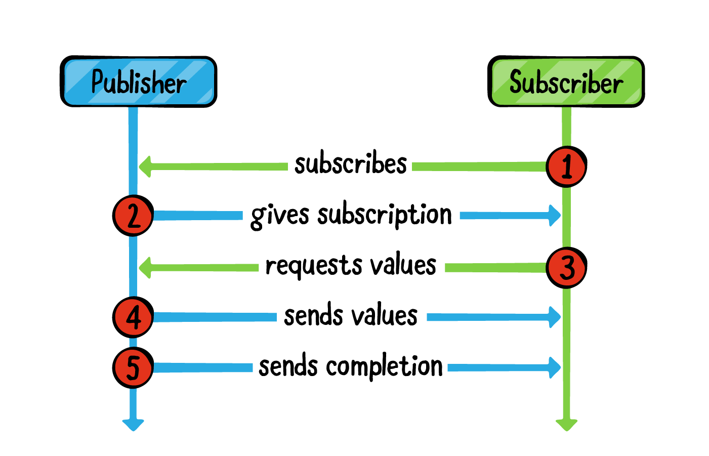

---
date: 2022-07-28 7:02
description: ازاي تهندل السبسكريبشنز في كومباين مع الفيو كونترولرز او الفيوموديلز
title: ازاي تهندل السبسكريبشن في كومباين
image: postThumps/Combine.png
tags:  Arabic, Interviews
---

لما تكون بتستخدم Combine في الفيوكنترولر/الفيوموديل، بيكون عليك مسؤلية هندلة و الحفاظ على السبسكريبشنز
aka Disposals 


لو افترضنا الكود الآتي كمثال على بابلشر بيأبديت الUI في الابلكيشن:


```
class ViewController: UIViewController { 

var disposeBag:Set<AnyCancellable> = []


func viewDidLoad(_ animated: Bool) { 
  super.viewDidLoad(animated)
  
  publisher.sink { newValue in 
    self.updateUI(with: newValue)
    }
  }/§.store(in: &disposeBag)  §/
}
```

اللي بيحصل هنا انه لما بنعمل سبسكرايب بنحفظ السبسكريبشن (AnyCancellable) في الSet الخاصة بالDisposeBag



ليه بنعمل كدا ؟ علشان لو محفظتش الريفرينس بتاع الكانسيلبل في Array/normal variable/Set الARC هيشيل الفاريبل من الميموري
وفي كومباين لازم علشان تستلم فاليوز، تكون حافظ السبسكريبشن 

كأنك لازم تفضل ماسك السلك اللي بيربطك بالبابلشر اللي بيبعت الداتا


نفترض انه خلاص انا اخدت الداتا اللي انا عايزها و دلوقتي الكنترولر دا اليوزر هيخرج منه، ازاي اكنسل السبسكريبشن بتاعتي و معدتش استلم اي داتا ؟ هل دا بيحصل بشكل اوتوماتيك ؟ ولا لازم اهندله بنفسي ؟ ايه اللي هيحصل لو انا مشيلتش الكانسيلبل و فضلت سايبه محفوظ ؟ 

كطريقة من طرق التعامل مع السؤال دي انه نعمل الآتي

```
class ViewController: UIViewController { 

  deinit {
    print("i'm leaving the memory")
  }
  
var disposeBag:Set<AnyCancellable> = []

/~ func viewDidDisappear(_ animated: Bool) ~/ { 
 super.viewDidDisappear(animated)
 /§ disposeBag.removeAll()  §/
}

func viewDidLoad(_ animated: Bool) { 
  super.viewDidLoad(animated)
  
  publisher.sink { newValue in 
    self.updateUI(with: newValue)
    }
  }.store(in: &disposeBag) 
}
```

لما الفيوكنترولر  يختفي من الشاشة(في اغلب الاحيان معاناه انه خلاص اليوزر مش شايفه، بس مش ديما)
ممكن تفضي الDisposeBag كلها، و بكدا السبسكريبشنز اللي محفوظة جواها هتتشال و الكنترولر كله هيتشال من الميموري

و تقدر تتأكد من دا بأنك تشوف deinit بيتعملها كول، لما تقفل الكنترولر، ورغم انه دا حل للمشكلة،،لكن هو بيترك عليك مسؤولية انك تعمل call 
للسطر دا كل في ViewDisAppear وفي بعض الاحيان مش هتبقى عايز تكنسل السبسكريبشن لما الفيو تختفي،

كحل اخر، ممكن تخلي مسؤولية كنسلة السبسكريبشن على ARC

```
class ViewController: UIViewController { 

  deinit {
    print("i'm leaving the memory")
  }
  
var disposeBag:Set<AnyCancellable> = []


func viewDidLoad(_ animated: Bool) { 
  super.viewDidLoad(animated)
  
  publisher.sink { /§ [weak self] §/ newValue in 
    self.updateUI(with: newValue)
    }
  }.store(in: &disposeBag) 
}
```

هنا احنا في الواقع حلينا مشكلتين، لأنه الكلوجر بتاع Sink بيكابتشر self، ودا في حد ذاته ممكن يعمل Memory Leak لو مفضتش الDisposeBag
لكن لما تخلي self weakly capturered دا هيخلي ARC يقدر يشيل الSet بتاعت DisposeBag

وبناء عليه، احسن حل لو انت جوا الفيوكونترولر/فيو موديل، انك متعملش سترونج كابتشر على سيلف، و عموما حاول متعملش سترونج كابتشر في الكلوجرز طول حياتك 😂

الكلام اللي في البلوج دي يمشي على اي ريآكتيف فريمورك زي RxSwift/ReactiveSwift وكدا..

والبوست دا هو استفاضة في اجابتي على نفس السؤال في ستاك اوفرفولو
https://stackoverflow.com/a/62964220/5253913


