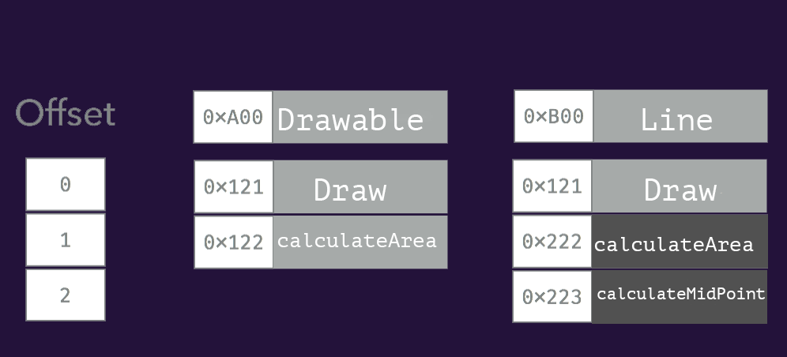
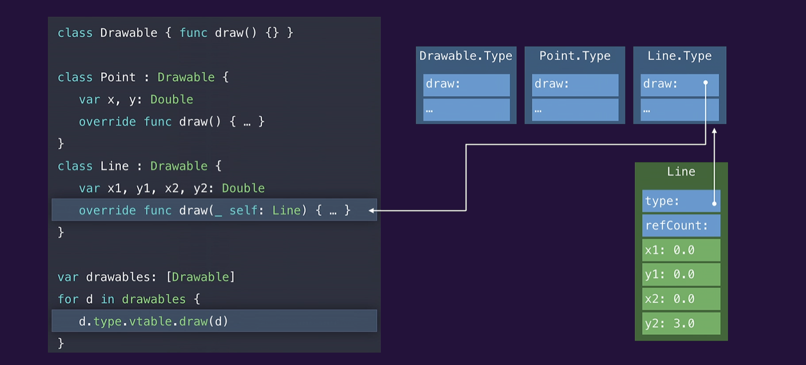
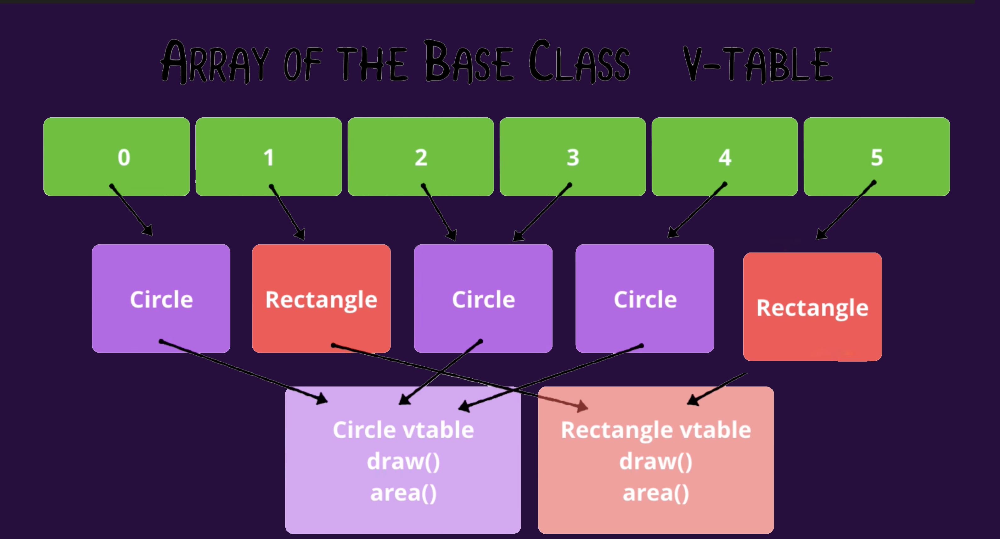

---
date: 2022-08-02 9:02
description: حديث عن الديسباتشينج
title: ازاي لغة البرمجة بتختار الامبلمنتيشن الخاص بالفانكشنز
image: postThumps/DispatchStatic.png
tags:  Arabic, Compilers
---

المعلومات في التدوينة دي هتكون مشروحة على لغة سويفت، لكن الاساسيات ثابتة غالبا في اغلب اللغات
حتى الان انا بفكر اذا العنوان الحالي هو احسن عنوان ولا فيه وصف احسن ؟ 

علشان اوضح السوال اللي انا بحاول اجاوب عليه، هكتب شوية امثلة ومنها هوضح السؤال، و نبدأ في الاجابة

## ايه المشكلة اللي بنفكر فيها ؟

```
class Animal { 
    func /~ sayYourName() ~/ { 
    print("i'm Animal")
    }
}

class Dog: Animal  { 
    override func /~ sayYourName() ~/ { 
    print("i'm dog")
    }
}
```
هنا احنا عملنا كلاس، و عملنا Subclass ليها اسمه Dog، و في الصب كلاس دي عملنا اوڤررايد لفانكشن sayYourName
لغاية هنا مفيش مشاكل

```
//Somewhere far away: 
let myAnimal: /§ Animal §/ = Dog()

myAnimal.sayYourName()
}

```
لو افترضنا انه عندك ڤاريبل نوعه Animal
و القيمة اللي جواه هي اوبجكت من Dog
الكود دا نظريا شغال ومفيهوش مشاكل، لأنه السوبركلاس(parent class) بتاعت الDog هي Animal

لكن السؤال، هنا كالآتي، بما انه الڤاريب دا نوعه Animal، الكومبايلر عنده خيارين لما انت تيجي تطلب 
sayYourName()

الخيار الاول، انه يختار الامبلمنتيشن بتاع السوبركلاس، او بتاع الصبكلاس،
ليه اصلا عنده الخيارين دول ؟ علشان نوع الڤاريبل Animal، وبناء عليه هو مش متأكد اذا اللي بعد علامة ال= عبارة عن اوبجكت من كلاس عاملة override للميثود بتاعت sayYourName ولا لا  


مثال آخر على نفس السؤال
```
protocol Player {
  func play()
}

class Messi: Player {
  func play() { print("This's Messi") }
}

class Salah: Player {
  
  func play() {
    print("This's Salah")
  }
}
```
 عندك بروتوكول بلاير، و فيه اكتر من كلاس بتكونفيرم ليه، زي كلاس ميسي، و صلاح، وكل واحد منهم عامل الامبلمنتيشن بتاع بلاي
 لغاية هنا الكود زي الفل
 
 بعدين
```
//somewhere far away
let favPlayers: [Player] = [ Messi(), Salah() /* More Players */ ]


for favPlayer in favPlayers {
  // favPlayer type is Player
  favPlayer.play()
}

```
لو جيت في مكان ما بعيد، عملت اراي، نوعها [Player]،يعني هي عبارة عن اراي ممكن تشيل جواها اي اوبجكت بيكونفيرم لPlayer
بعدين عملت for-loop على الاراي دي وعلى كل اليمنت جوا الاراي، عملت call لplay

السوال هنا، ازاي /لغة البرمجة/البرنامج، بيقدر يحدد الامبلمنتيشن اللي يعمله call؟ 
لأنه ممكن البلاير اللي جوا الfor-loop يكون نوعه ميسي، او صلاح، او نوع اخر، ودا مش هيبان غير و الكود شغال


السؤال اللي احنا بنوصفه هنا اسمه في البرمجة
Method Dispatching

> Method dispatch is the algorithm used to decide which method should be invoked in response to a message(function call).

> The goal of dispatch is for the program to tell the CPU where in memory it can find the executable code for a particular method call.

لحل المشكلة دي او الاجابة على سؤال: ازاي الكومبايلر/لغة البرمجة بتحدد الامبلمنتيشن اللي تعمله call فيه اكتر من طريقة، وكل طريقة ليها مميزاتها و عيوبها

### Table Dispatch
في الطريقة دي، بيتم عمل جدول لكل كلاس(سواء كانت صب كلاسد من كلاس اخرى، او لا)، الجدول دا بيحتوي على مكان كل فانكشن في الميموري، مثال الكود الآتي هيتم توليد الجداول دي ليه، الجداول بيتم توليدها في الكومبايل تايم(في اغلب الاحيان)

```
class Drawable { 
  func draw() { }
  
  func calculateArea() { }
}


class Line: Drawable { 
  var x1,y1,x2,y2: Double
  

  override func calculateArea() { ... }
  
  func calculateMidPoint() { ... }

}

```




الجداول دي ماهي الا تمثيل لArray بيتم توليدها، بتقول ايه ايه الجداول دي؟

<ol>
<li>بالنسبة لكلاس Drawable فهي تحتوي على اتنين فانكشن، و كل فانكشن موجود جنبها عنوانها في الميموري</li>

<li>بالنسبة لكلاسLine فهتلاقي انه العنوان بتاع فانكشن Draw متغيرش، ليه ؟ لأنها معملتش اوڤررايد للامبلمنتيشن بتاعها </li>


<li>بالنسبة للفانكشنز اللي اتعملها اوڤررايد، زي CalculateArea فهتحصل على عنوان جديد</li>

<li>بالنسبة للفانكشنز الجديدة تماما(يعني مش موجود في السوبركلاس) هتبقى متضافة في اخر التيبل </li>
</ol>

الجداول دي مفيدة لكن ازاي بتستخدم ؟ 
لما تعمل call لفانكشن على اوبجكت نوعه Lineبيحصل الآتي
خلينا نقول اني بعمل كول لDraw 


```
let line = Line()
line.calculateArea()

/* 
1. Read the table for the Object 0xB00
2. Read the function pointer at the index for the method. In this case, the method index for calculateArea is 1, so the address (0xB00 + 1) will be read.¹, 0xB00 represent the start on an array, 
and 1 is the offset to get the needed element (which in this case the the memory address of the needed function implementation)
3. Jump to the address 0x222 


- ¹The index of each function name is stored in Hash Map/ Dictionary, so at the runtime you can get offset of any function 

- ¹You can assume that functions are indexed as they appear in the source code/or after being ordered, 
this's an implementation detail and beyond the scope of this article, we may discuss it later., also it varies from languages, some languages use hash tables instead of indices.
*/
```

الكومنت في الكود بيوضح الخطوات، وهي


<ol>
<li>
 و الكود شغال، بيروح للتيبل الخاص بالاوبجكت(التيبل ثابت لكل الاوبجكتس من نفس الكلاس)
 
</li>

<li>
بيروح للتيبل، و يقوله انا عايز انفذ الفانكشن اللي اسمها CalculateArea
بيتم تحويلها لoffset،في حالتنا الoffset بتاع الفانكشن ١، وبناء عليه الادريس اللي هنروحله هيكون 0xb00 + 1 وهيلاقي  جواه الادريس 0x222

الادريس دا هو الامبلمنتيشن اللي احنا عاوزينه، اللي هو الامبلمنتيشن بتاع CalculateArea.

</li>

<li>
السيستم هيروح للأدريس CalculateArea اللي هو 0x222  وينفذ الامبلمنتيشن المناسب.


</li>
الطريقة دي اسمها V-Table dispatch و هي تستخدم مع الClasses و منها بيحصل ما يسمى ب
Runtime Polymorphism
 
 </ol>
 
 
 ### مميزات الTable Dispaching 
 
 
 <ul>
 
 <li>
 ✅ الخطوات بسيطة و ادائها متوقع: 
 الاداء متوقع و ثابت لأنه لما تحتاج توصل لأي فانكشن، محتاج الاوفسيت بتاعها وبعدين هتعمل الآتي
 
 <br>
 needed function pointer = Base Address + (offset * function pointer size)

 في المثال بنفترض انه الفانكشن بوينتر ١ ورد، وتقدر تقول في صياغة اخرى، لأنه البوينترز متخزنة في اراي، فديما علشان توصل لأي فانكشن ما دام معاك البوينتر هيكون O (1)
 
 </li>
 </ul>
 
 
 
 #### عيوب الTable Dispatch
 
  
<ul>
 <li>
 👎🏻: للحصول على اي فانكشن بوينتر، محتاجين نعمل دا 
 <ol>
 
 <li>
 Read the V- Table Address (Base address) → Read Instruction
 
  </li>
  
   <li>
Read the address of the pointer (Base Address  + offset) → Read instruction
 
  </li>
 
    <li>
Go to the address of the function → Jump instruction  
  </li>
  
 </ol>
 
 الانستراكشنز دي تعتبر اوڤرهيد وليه كوست، لأنه لو كان معاك البوينتر، مكنتش هتحتاج تعمل كل دا 
  <li>
  
  👎🏻: الطريقة دي مش هتشتغل مع الاكستنشنز لأنه الاكستنشنز بتضيف فانكشنز اكتر على الكلاس، وهنا هيكون فيه تعقيد اكتر و احتياج لطرق آخرى
  </li>
 </ul>

 ## ازاي بنوصل للVtable نفسه 
يظل السؤال قائم، ازاي اصلا الكود وهو شغال بيوصل للVtable الخاص بكل اوبجكت  ؟ 
الاجابة هنا تكمن في كود بيتعمله جينيريت و البرنامج بيتعمل Compile

كمثال، الكود دا لما بيتعمله كومبايل، بيحصل جينريت للكود اللي بعده 


```
class Drawable { func draw() {} }

class Point: Drawable { 

  var x, y: Double
  override func draw() { ... }
  
}

class Line: Drawable { 
  var x1,y1 ,x2, y2: Double

  override func draw() { ... }
}


// Some where far away...

var drawables: [Drawable]
for d in drawables { 
  d.draw()

}
```
الكود اللي بيتعمله جينريت: 

```
class Drawable { func draw() {} }

class Point: Drawable { 

  var x, y: Double
  override func draw() { ... }
  
}

class Line: Drawable { 
  var x1,y1 ,x2, y2: Double
   /~ var type: LineProperties ~/
  
  override func draw(/~_ self: Line~/) { ... }
}


// Some where far away...

var drawables: [Drawable]
for d in drawables { 
  d./~type.vtable.draw~/(d)

}
```


اللي بيحصل هنا انه اثناء الكومبايليشن بيتم توليد ڤاريبل type
و الفاريبل دا بيحمله جواه ڤاريبل الvtable، اللي هو كنا بنشاور عليه فوق ونقول عليه
Base Address
و بعدين لما بنعمل call لdraw
احنا فعليا بنعملها كول من الvtable، وبناء عليه بنحتاج نباصي لها self

الكود بيتعمله جينريت في مرحلة بيتم تحويل فيها كود سويفت اللي مكتوب لكود SIL وهو
Swift intermediate Language
ودي عايزة لها مواضيع كتير اخرى..


### الختام


دي صورة اخرى بتوضح المنظر لأكتر من عنصر جوا اراي، و ازاي كل اوبجكت بيشاور على الVtable
<br>
هنا حاولت اتكلم عن طريقة واحدة بس من طرق الDispatching، فيه طرق تانية، وكلهم مستخدمة في سويفت، و الطرق دي ادائها احسن في اغلب الاحوال، لكن لو تطرقت لهم الارتيكل هيبقى طويل جدا، وفيه تفاصيل اكتر في الموضوع دا، زي انه احنا هنا شرحنا الكلاسز، لكن البروتوكلات بيحصل فيها ايه ؟ و اذا عملنا اكستنشن للكلاس ؟ كل دي تفاصيل اكتر، هحاول اغطيها اذا قدرت في تدوينات اخرى، الارتيكل دا كان كبير،لو حسيت انه عندي غلط، او فيه نقطة محتاجة تتوضح اكتر اتمنى تقولي..

